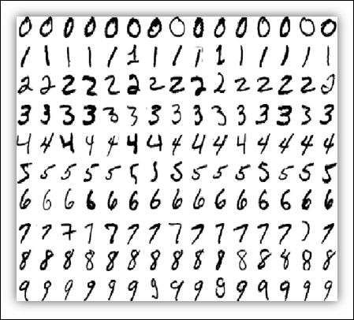

```{r setup, include=FALSE}
knitr::opts_chunk$set(echo = FALSE, warning = FALSE, cache = TRUE, message = FALSE,
                      fig.width = 8)  # Hide code by default. Can override chunk-by-chunk
library(tidyverse)
library(rpart)
library(caret)
```


# {.col-2}

## O Conceito de Boosting
* Combinar um grande número de preditores simples para compor um bom preditor.
* Os preditores (árvores de decisão) são ajustados sequencialmente de maneira a melhorar o desempenho do anterior, ao compreender melhor as regiões com altas taxas de erro.
* Se pensarmos que cada árvore tem um "voto" na decisão final, o método nos fornece um comitê em que a decisão final é a ponderação de todos os votos. Aqueles que têm grande convicção têm mais poder na decisão.

## Visualização

### Primeiras iterações
```{r}
set.seed(5)
df <- data.frame(x = runif(100, 0, 5)) %>%
  mutate(y = rnorm(100, mean = 1.8*x))

m1 <- train(y~x,
            df,
            method = "xgbTree",
            tuneGrid = data.frame(nrounds = c(1),
                                   max_depth = c(1),
                                   eta = c(1),
                                   gamma = 0,
                                   colsample_bytree = 1,
                                   subsample = 1,
                                   min_child_weight = 1))

ggplot(df, aes(x = x, y = y)) + 
  geom_point(color = "blue", size = 3, alpha = 0.5) + 
  geom_line(aes(x = x, y = predict(m1)), color = "red") + 
  theme_bw() + 
  ggtitle("H1") + 
  theme(plot.title = element_text(size=22, hjust = 0.5))
```

###
```{r}
df2 <- df;
df2$y <- residuals(m1)

m2 <- train(y~x,
            df2,
            method = "xgbTree",
            tuneGrid = data.frame(nrounds = c(1),
                                   max_depth = c(1),
                                   eta = c(1),
                                   gamma = 0,
                                   colsample_bytree = 1,
                                   subsample = 1,
                                   min_child_weight = 1))

ggplot(df2, aes(x = x, y = y)) + 
  geom_point(color = "orange", size = 3, alpha = 0.5) + 
  geom_line(aes(x = x, y = predict(m2)), color = "red") + 
  theme_bw() + 
  ggtitle("Resíduos H1 e H2") + 
  theme(plot.title = element_text(size=22, hjust = 0.5))
``` 

###
```{r}
m3 <- train(y~x,df,
            method = "xgbTree", 
            tuneGrid = data.frame(nrounds = c(2),
                                   max_depth = c(1),
                                   eta = c(1),
                                   gamma = 0,
                                   colsample_bytree = 1,
                                   subsample = 1,
                                   min_child_weight = 1))

ggplot(df, aes(x = x, y = y)) + 
  geom_point(color = "blue", size = 3, alpha = 0.5) + 
  geom_line(aes(x = x, y = predict(m3)), color = "red") + 
  theme_bw() + 
  ggtitle("H2") +
  theme(plot.title = element_text(size=22, hjust = 0.5))
```

###
```{r}
df4 <- df; 
df4$y <- residuals(m3)

m4 <-  train(y~x,df4, 
             method = "xgbTree", 
             tuneGrid = data.frame(nrounds = c(1),
                                   max_depth = c(1),
                                   eta = c(1),
                                   gamma = 0,
                                   colsample_bytree = 1,
                                   subsample = 1,
                                   min_child_weight = 1))

ggplot(df4, aes(x = x, y = y)) + 
  geom_point(color = "orange", size = 3, alpha = 0.5) +
  geom_line(aes(x = x, y = predict(m4)), color = "red") + 
  theme_bw() +
  ggtitle("Resíduos H2 e H3") + 
  theme(plot.title = element_text(size=22, hjust = 0.5))
```

### ... {.fullwidth}

###
```{r}
m5 <- train(y~x,df, 
            method = "xgbTree", 
            tuneGrid = data.frame(nrounds = c(20),
                                   max_depth = c(1),
                                   eta = c(.8),
                                   gamma = 0,
                                   colsample_bytree = 1,
                                   subsample = 1,
                                   min_child_weight = 1))

ggplot(df, aes(x = x, y = y)) + 
  geom_point(color = "blue", size = 3, alpha = 0.5) + 
  geom_line(aes(x = x, y = predict(m5)), color = "red") +
  theme_bw() + 
  ggtitle("H20") + 
  theme(plot.title = element_text(size=22, hjust = 0.5))
```

###
```{r}
df5 <- df;
df5$y <- residuals(m5)

m6 <-  train(y~x,df5, 
             method = "xgbTree", 
             tuneGrid = data.frame(nrounds = c(1),
                                   max_depth = c(1),
                                   eta = c(1),
                                   gamma = 0,
                                   colsample_bytree = 1,
                                   subsample = 1,
                                   min_child_weight = 1))

ggplot(df5, aes(x = x, y = y)) + 
  geom_point(color = "orange", size = 3, alpha = 0.5) +
  geom_line(aes(x = x, y = predict(m6)), color = "red") + 
  theme_bw() + 
  ggtitle("Resíduos H20 e h21") +
  theme(plot.title = element_text(size=22, hjust = 0.5))
```

## Visualização das Árvores

```{r}
m_plot <-  train(y~x,df, 
             method = "xgbTree", 
             tuneGrid = data.frame(nrounds = c(3),
                                   max_depth = c(1),
                                   eta = c(1),
                                   gamma = 0,
                                   colsample_bytree = 1,
                                   subsample = 1,
                                   min_child_weight = 1))

xgboost::xgb.plot.tree(model = m_plot$finalModel)
```


# {.col-2}

## Gradient Boosting

Direção fornecida da solução pelo método do Gradiente e sua conexão com os resíduos fornecem a intuição e a engrenagem por detrás do método.

### Algoritmo

* $(y_i, x_i), i = 1,\dots, N$;
* $L(\cdot, \cdot)$ - função perda;
* Inicie com o preditor constante $H_0 = \arg \min_c \sum_{i = 1}^N L(y_i,c)$;
* Para $m = 1, \dots, M$ faça:
  1. Calcular os pseudo-resíduos
    $$r_{im} = -\left[ \frac{\partial L(y_i, G(x_i))}{\partial G(x_i) }\right]_{G(x_i) = H_{m-1}(x_i)};$$
  2. Ajustar uma nova árvore $h_m$ aos resíduos $(r_{im},x_i);$
  3. Calcule o peso do voto $\gamma_{m}$ como 
  $$\gamma_m = \underset{\gamma}{\operatorname{arg\,min}} \sum_{i=1}^n L\left(y_i, H_{m-1}(x_i) + \gamma h_m(x_i)\right);$$
  4. Atualize o modelo:
$$\displaystyle H_{m}(x)=H_{m-1}(x)+\gamma_m h_m(x);$$
* Defina o preditor final como 
  $$G(x) = H_M(x).$$

### Vantagens
* Alto poder de preditivo (ganhador de vários concursos recentes)
* Otimização direta da função perda (regressão, classificação, regressão quantílica, modelo de cox, ranqueamento, etc...).
* Não requer nenhum tipo de pré-processamento.
* Pode ser paralelizado;

### Desvantagens
* Alto custo computacional;
* Pode ser muito sensível a dados muito ruidosos;
* Sequer refinamento cuidadoso;


### Refinamento {.fullwidth}
Principais refinamentos do Gradient Boosting incluem:

 * Subamostragem: Sortear um subconjunto de tamanho $N' < N$ da amostra de treino para o ajuste do preditor a cada passo.
 * Penalização: Encolher os preditores por algum valor $\alpha < 1$, isto é, substituir o passo de atualização por 
 $$\displaystyle H_{m}(x)=H_{m-1}(x)+\alpha \gamma_m h_m(x).$$
 * Número de nós terminais: Utilizar diferentes números de nós terminais para as árvores.
 
 
### Implementação {.fullwidth}
Algumas das principais implementações do algoritmo de Gradient Boosting em `R` são:

* Pacote `gbm`: Generalized Boosted Regression Models;
* Pacote `xgboost`: Extreme Gradient Boosting;
* Plataforma `h2o`: www.h2o.ai;
* Pacote `LightGBM`: Implementação da Microsoft para gbm;


# {.col-2}

## Uma aplicação

### Conjunto de dados MNIST



 
### Resultados


* 60000 Imagens 28x28 pixels de dígitos escritos a mão.
* Classificação dos dígitos (107 categorias) utilizando os valores dos 784 pixels como covariáveis.
* Acurácia de 97.33% no conjunto de teste da competição no Kaggle, utilizando Gradient Boosting, com taxa de aprendizado $\alpha = 0.08$, árvores com 7 nós nos classificadores e 600 passos de Boosting, **sem nenhum tipo de pré-processamento**.
* Implementação em `R` utilizando o framework `h2o` e resultados no Kaggle disponíveis no QR-code.


# {.col-2}

## Conclusão

* Boosting produz preditores muito eficazes;
* Extretamente versátil;
* Apesar de incluir diversos parâmetros de refinamento, exceto em casos específicos, muitos não tem grande efeito na qualidade final das predições; Por outro lado, podem drasticamente reduzir o custo computacional ou alterar a quantidade necessária de passos até produzir um bom preditor;
* A forma com que o algoritmo é construído causa a impressão de que o overfitting deve ocorrer, mas a quantidade necessária de passos para que ele de fato ocorra é muito grande. 

## Referências

* Friedman, J. H. (2001), ‘Greedy function approximation: a gradient boosting machine’,
Annals of statistics pp. 1189–1232.
* Friedman, J., Hastie, T. & Tibshirani, R. (2001), The elements of statistical learning, Vol. 1,
Springer series in statistics New York, NY, USA:.
* Schapire, R. E. (1990), ‘The strenght of weak learnability’, Machine Learning 5, 197–227.
