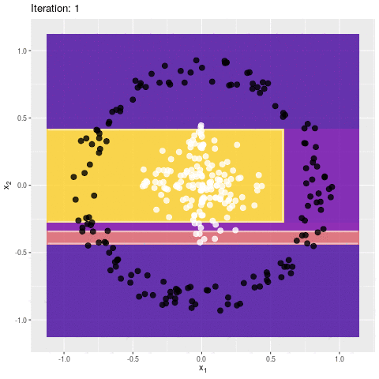
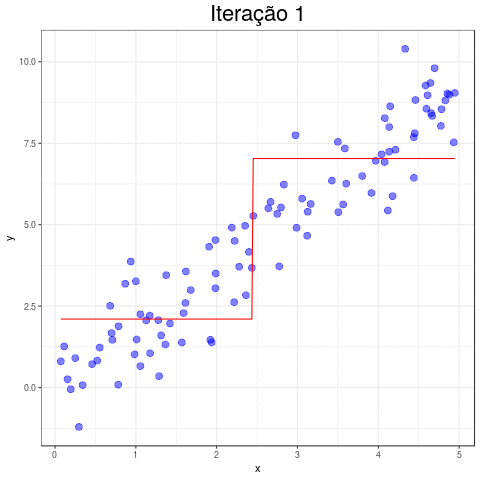
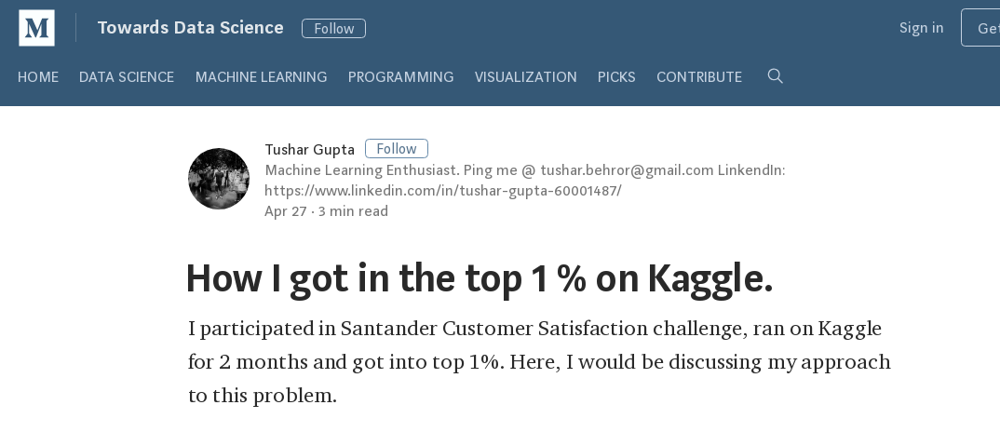
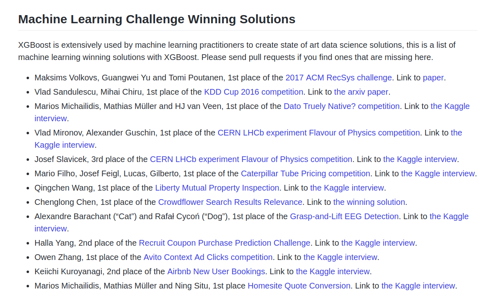
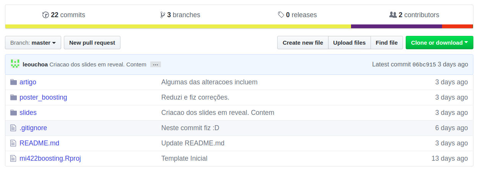
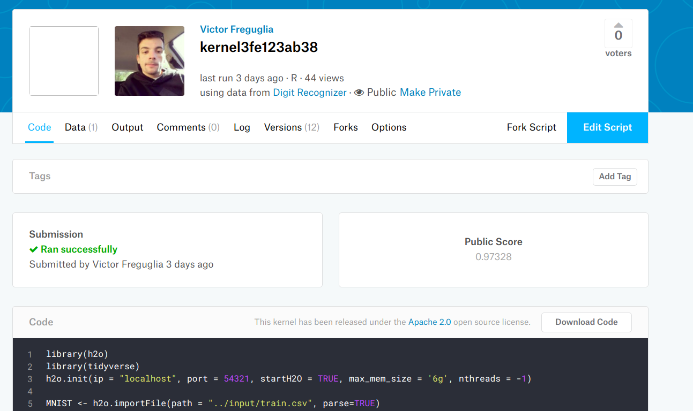

```{r setup, include = FALSE, eval = FALSE}
library(emo)
```


## Ideia Básica

- Ajustar um monte de árvores sequencialmente.
- Onde? Nos resíduos!!!
- Melhorar o desepenho a cada passo.

## Pseudo-Algoritmo

- Começar do preditor constante
- Para $m = 1, \dots, M$
  1. Calcula os pseudo-resíduos do preditor atual;
  2. Ajusta uma nova árvore nos pseudo-resíduos.
  3. Calcula o "peso" da nova árvore
  4. Atualiza o preditor somando a nova árvore ponderada

## Ilustração - Classificação



## Ilustração - Regressão

```{r, eval = FALSE, include = FALSE, echo = FALSE}
oopts = ani.options(interval = 0.3)
ani.record(reset = TRUE)

for(i in 1:50){
  m1 <- train(y~x,
              df,
              method = "xgbTree",
              tuneGrid = data.frame(nrounds = c(i),
                                    max_depth = c(1),
                                    eta = c(1),
                                    gamma = 0,
                                    colsample_bytree = 1,
                                    subsample = 1,
                                    min_child_weight = 1))
  
  plot(ggplot(df, aes(x = x, y = y)) + 
    geom_point(color = "blue", size = 3, alpha = 0.5) + 
    geom_line(aes(x = x, y = predict(m1)), color = "red") + 
    theme_bw() + 
    ggtitle(paste0("Iteração ",i)) + 
    theme(plot.title = element_text(size=22, hjust = 0.5)))
  ani.record()
}

saveGIF(ani.replay(), "animation_reg.gif")
```



## Vantagens e Desvantagens

`r emo::ji("thumbs_up")`

* Alto poder de preditivo;
* Otimização direta da função perda;
* Não requer pré-processamento.

`r emo::ji("thumbs_down")`

* Alto custo computacional;
* Sensível a ruído excessivo;
* Requer refinamento cuidadoso;

## Exemplos de Sucesso

##


##



## 



## Implementações

* Pacote gbm: Generalized Boosted Regression Models;
* Pacote xgboost: Extreme Gradient Boosting;
* Plataforma h2o: www.h2o.ai;
* Pacote LightGBM: Implementação da Microsoft para gbm;

## 

* Conteúdo disponível em: https://github.com/Freguglia/mi422boosting



## Aplicação MNIST com h2o

